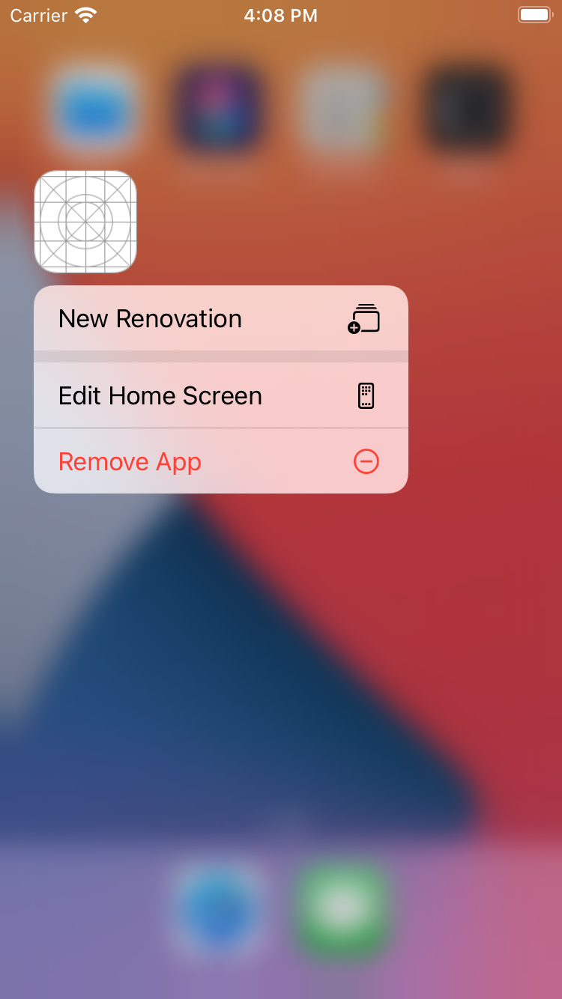
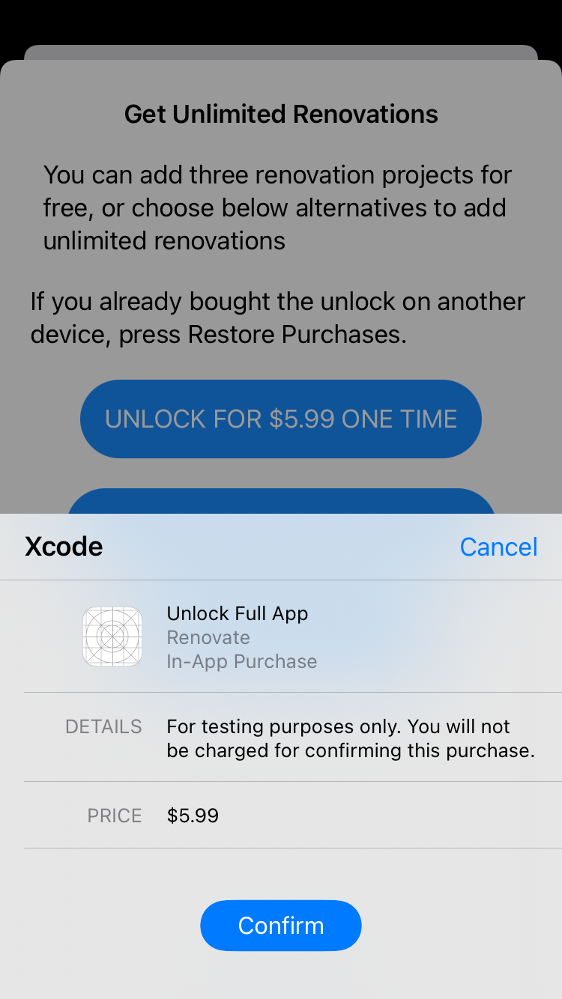
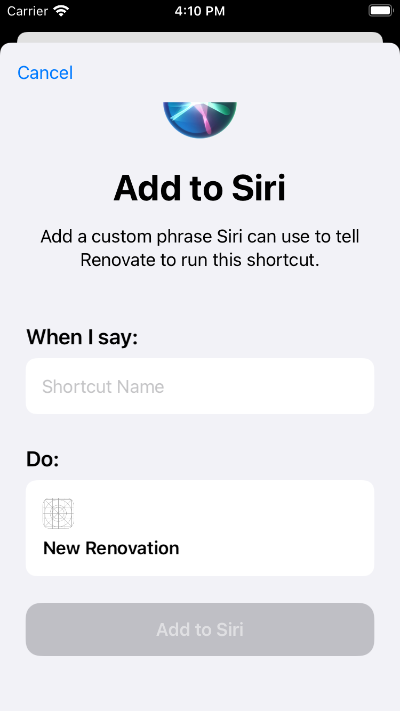
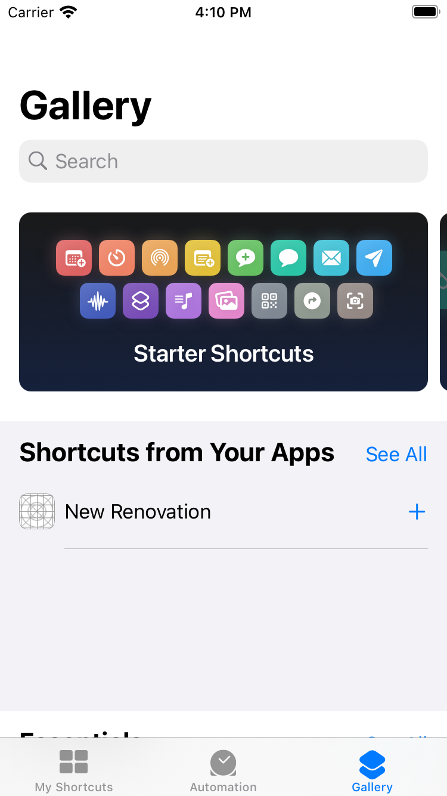
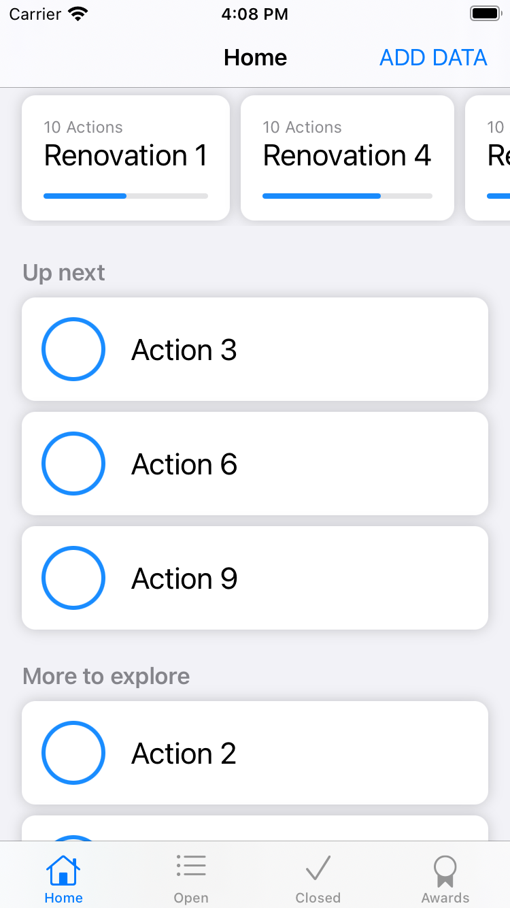
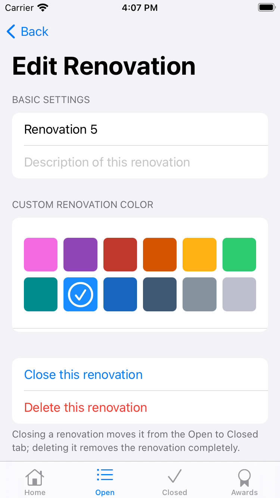
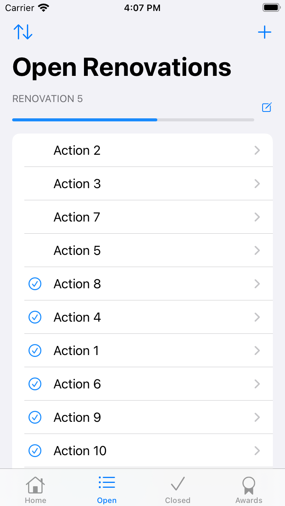
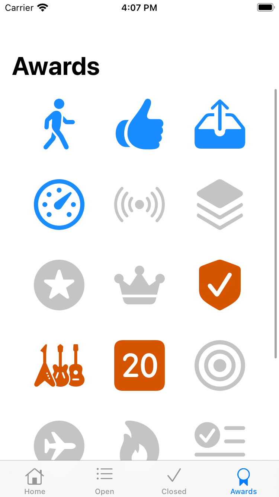

# Renovate App

SwiftUI, ios14, xcode12

## Demo
      
 

## App Description
Not only for house, but also for your life!

New Resolution doesn't need to wait until new year, now is the best time to start your renovation project on your life!

No matter you want to renovate your body, to build shape and more energetic everyday.
or you want to renovate your network, to expand and strengthen your professional and social network.
or maybe you want to renovate your physical house, to clean out things no longer resonate to you. 

Renovate App is here to serve you!

## IOS, SwiftUI Technical Details
This is portfolio app, so here are details of different skills applied. 

### Localization
Localizable.strings: English (sysetm), Swedish
Localizable.stringsdict: Localize the variable format in sentence ( e.g. 1 apple, 2 apples)
Use `genstrings -SwiftUI *.swift -s localize -o .`  with string extension to internationalize all strings
Use tablename to category localization strings to be more maintainable

### Accessibility
VoiceOver: label, trait, hint, children
 
 ### Design Pattern: MVVM
#### Model
Major Core data
#### View
RenovationView.swift
HomeView
ActionRowView
#### ViewModel
RenovationViewModel.swift.
HomeViewModel
ActionRowViewModel

#### Mechanism
VM calss is put inside extension of `RenovationView`, but in a seperate file, to seperate core data and view for clean code.
Due to `@FetchRequest` can only work with SwiftUIView, the project uses 
`NSFetchedResultsController` to fetch the data. 
When the core data has been updated,  `controllerDidChangeContent`  will be called, and pass the change to `@Published`, so `RenovationView` get updated. (reactive)

Seperate conditional viewItems into conditional `colorName: String`, `systemImageName: String`  from view

### In-App-Purchase
The project choose one non-consumble product as example. 
With configuration of *.storekit, and change in Edit Scheme. 
It is possible to simulate purchase with Xcode.

As well with a UI to show available products.

### Ask for Review
If the user is active using the app (t.e.x. purchased and having more than 5 projects)
Then we ask for review upon start.
Tool: SKStoreReviewController API

### Spotlight (Search in iOS home screem)
#### Searchable
To be able to search Action in spotlight,  we need to:
1. Create an unique identifier 
    => using objectID of Action  
2. Choose suitable attributes
   => using title and contentDescription
3. Wrap up 1 & 2 in a record with a domain identifier. 
  => using objectID of Renovation 
4. Send 3. to Spotlight for indexing

#### Open <Action Item> directly from iOS Home
Listen to `onContinueUserActivity`
if it is called with correct search type, 
using `navigationLink` to programatically switch to the specific `EditActionView`

#### Delete index when delete Renovations and actions
`CSSearchableIndex.default().deleteSearchableItems(withIdentifiers: [id])`

### Quick Action
1. Create URL of application in Target/info
2. Add UIApplicationShortcutItem in info.plist
3. Create AppDelegate and SceneDelegate class
4. On ContentView, listen to `.onOpenURL`

### Shortcut
(After Spotlight and Quick Action in place as above)
1. Create new `NSUserActivityTypes` in info.plist
2. Define and listen to `onContinueUserActivity`

## Credits
Thanks for the teaching of Paul Hudson in *Hacking With Swift* 
